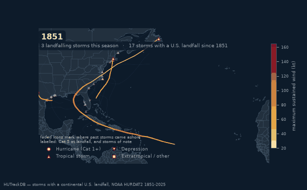

# HUTrackDB

A curated Atlantic and Pacific hurricane track database for the United States,
CONUS, and territories, built from NOAA HURDAT2.

Ingests the official HURDAT2 fixed-format text into a normalized geodatabase,
then adds the layer HURDAT2 does not provide: **complete landfall detection**,
because HURDAT2's own landfall flagging has documented gaps.

Built to be consumed by multiple downstream teams — the schema is generic and
documented, not tailored to one analysis.



*Every storm with a continental U.S. landfall, genesis to lysis, one season per
beat. Track colour and width follow maximum sustained wind on each segment;
marker shape follows system type; a faded icon stays on the coast at each past
landfall, so 1,548 impact points accumulate into the coastal band. Generated
from the committed tables by [`scripts/animate_landfalls.py`](scripts/animate_landfalls.py).*

---

## What's in the current build

| | |
|---|---|
| Storms | **3,266** (Atlantic 1851–2025, NE/N-Central Pacific 1949–2025) |
| Track points | **87,631** |
| Landfalls | **4,260** countable (1,568 US), plus 2,361 overland re-entries |
| Landfall gates | **5,007** |
| Bypass (near-miss) storms | **684** |
| Parse warnings | **0** |

Validated against NOAA's *All U.S. Hurricanes* list: **285 reference CONUS
landfalls vs 292 detected**, with **105/110 named-era storms matched exactly**
and **zero reference storms undetected**. Every remaining difference is
classified and explained in the QA report.

---

## Quick start

The built **Parquet tables ship with this repository** (~5 MB), so you can query
the database immediately — no download, no build step:

```bash
python -m venv .venv && .venv/bin/pip install -e .
```

```python
import geopandas as gpd
landfalls = gpd.read_parquet("data/processed/parquet/landfalls.parquet")
us = landfalls[landfalls.is_landfall & landfalls.is_us_landfall]
```

The EDA and validation notebook likewise runs straight from a fresh clone:

```bash
jupyter lab notebooks/eda_validation.ipynb
```

### Rebuilding from source

Optional — regenerates the same Parquet tables plus the GeoPackage and SQLite
builds:

```bash
python scripts/fetch_sources.py     # download HURDAT2 + coastline + reference
```

```bash
python -m hutrackdb build           # full pipeline -> all outputs
```

```bash
python -m hutrackdb qa              # validate against All U.S. Hurricanes
```

Outputs land in `data/processed/`:

| File | In git? | Use |
|---|---|---|
| `parquet/` | **yes** (~5 MB) | GeoParquet per table — geometry included; also the Snowflake staging format |
| `hutrackdb.gpkg` | no (23 MB) | Single-file geodatabase — opens directly in geopandas, QGIS, ArcGIS |
| `hutrackdb.sqlite` | no (27 MB) | Plain relational, with foreign keys and indexes |
| `snowflake_ddl.sql` | no | Snowflake DDL, GEOGRAPHY views, and COPY INTO template |
| `qa_report.md` | no | Validation report |

Only the Parquet tables are committed. They carry the full content — every
table is GeoParquet, so `gpd.read_parquet` returns geometry ready to plot. The
GeoPackage and SQLite builds hold identical data but are large binaries that,
being SQLite files with embedded write timestamps, are never byte-identical
between builds; committing them would add a fresh multi-megabyte blob to git
history on every rebuild. Regenerate them with `python -m hutrackdb build`.

---

## Schema

Five tables, normalized, long-form. Join on `storm_id`.

```
storms ──1:N── track_points          one row per best-track record
   │                                 (6-hourly + asynoptic), with
   │                                 min_distance_to_coast_km on EVERY row
   ├────1:N── landfalls ──N:1── landfall_gates
   │                                 one row per COASTLINE CROSSING,
   │                                 not per storm
   └────1:1── bypasses               near-miss storms, closest approach
```

Full column-by-column reference: **[docs/FIELD_DEFINITIONS.md](docs/FIELD_DEFINITIONS.md)**.

### Two things to know before querying

**1. `landfalls` is one row per crossing, not per storm.** Filter
`is_landfall = TRUE` for countable landfalls; rows with `is_landfall = FALSE`
are overland re-entries (bay and sound crossings), kept for completeness.

**2. `is_us_landfall` includes Hawaii, Puerto Rico, the Virgin Islands and
Alaska.** Filter on `landfall_admin1` if you mean CONUS only.

---

## The landfall problem, and how it's handled

HURDAT2's native landfall flag (`L`) is authoritative but **incomplete**. From
the format specification:

> "For the years 1851-1970 and 1991 onward, all continental United States
> landfalls are marked, while international landfalls are only marked from 1951
> to 1970 and 1991 onward."

So **CONUS 1971–1990 has no complete native flagging.** A supplementary
detection layer fills the gap.

**The definition is geometric and threshold-free:** a landfall is where the
storm centre's track crosses from water onto a landmass it was not already on.
Consecutive fixes are joined by a geodesic, densified to 1 km, and tested for
water→land transitions. There is no distance cutoff to tune — deliberately, so
the definition cannot be quietly biased by an invented number.

Bay and sound crossings are separated from real landfalls by two **structural**
tests, neither using a threshold: whether the landmass is one the storm was
already on, and whether a best-track fix actually places the storm over water
in between.

**Native flags always win.** A crossing carrying HURDAT2's `L` flag is never
demoted by the geometric tests. Every landfall records its provenance:

| `detection_method` | Count | Meaning |
|---|---:|---|
| `native_confirmed` | 1,253 | `L`-flagged and independently reproduced geometrically |
| `native` | 57 | `L`-flagged; geometry did not reproduce it |
| `inferred` | 2,950 | Found geometrically; no native flag |

Full methodology, worked examples, and limitations:
**[docs/LANDFALL_METHODOLOGY.md](docs/LANDFALL_METHODOLOGY.md)**.

### Timing matters for intensity

For storms intensifying right up to the coast, *which* time you call landfall
changes the intensity you attribute to it. Both are stored, neither is
canonical:

- `exact_*` — the to-the-minute NHC landfall record (1991+) or the interpolated
  crossing
- `sixhr_*` — the nearest synoptic fix at or before the landfall

**1,768 landfalls have different winds at the two times.** Michael (2018):
125 kt at the 12:00 UTC fix, **140 kt** at the 17:25 landfall — a full
Saffir-Simpson category apart.

### Multi-landfall and cross-border storms

Each crossing is its own row with its own `landfall_country`. A storm striking
Mexico and then the US produces multiple rows — no special tag needed, and it
generalises to any number of countries. Harvey (2017) yields 8 landfalls across
Barbados, St Vincent, Mexico, Texas (barrier island *and* mainland separately),
and Louisiana.

---

## Swappable inputs

Both major reference inputs are documented, swappable files. Neither requires
touching pipeline code.

| Input | Default | Substitute via | Docs |
|---|---|---|---|
| **Coastline** | Natural Earth 1:10m Admin-1 (public domain) | `coastline.override_path` | [COASTLINE.md](docs/COASTLINE.md) |
| **Landfall gates** | 5,007 uniform gates at 50 km spacing | `gates.override_path` | [GATES.md](docs/GATES.md) |

Substituting either is a **configuration change only** — no code is edited.
Point the config at your file, map its column names if they differ, then:

```bash
python -m hutrackdb build && python -m hutrackdb qa
```

```bash
python -m nbconvert --to notebook --execute --inplace notebooks/eda_validation.ipynb
```

`build` also regenerates the notebook's display basemap from whichever coastline
you configured, so the map can never be left drawn on the previous one. The
notebook prints the coastline and gate set behind the build it is reading, so a
stale database is visible immediately.

This path is verified end to end: a coastline with entirely different column
names plus a 12-gate proprietary set were substituted, and build, QA and the
notebook all ran clean with 28/28 checks passing. If a substituted source spells
admin units differently, the QA layer and notebook **fail loudly** with the
values actually present rather than silently returning an empty scope.

```bash
python -m hutrackdb gates --export my_gates.geojson   # start from the default
```

---

## Data integrity: no fabricated values

This project forbids invented quantitative values, and the pipeline **enforces
it mechanically** rather than by convention.

Every tunable number lives in `config/pipeline.yaml` with a `status` and a
`source`. `hutrackdb.config` validates this at load time and **refuses to run**
if a parameter in use is still `UNCONFIRMED`, or is `confirmed` without a named
approver.

```bash
python -m hutrackdb provenance      # print the full calibration register
```

The design minimises how many such numbers exist at all:

| Parameter | Value | Status | Basis |
|---|---|---|---|
| `bypass_radius_km` | 111.12 | confirmed | 60 nmi exactly — the default search radius of NOAA's Historical Hurricane Tracks tool, a designated cross-check reference |
| `gate_spacing_km` | 50.0 | confirmed | Analyst-chosen resolution, PI-approved 2026-08-05. Affects only the default gate set |
| `landfall_segment_step_km` | 1.0 | sourced | Numerical tolerance bounded by the source: HURDAT2 records position to 0.1° (≈11.1 km), so 1 km is already finer than the data supports |

Constants that *are* externally defined — Saffir-Simpson thresholds, HURDAT2
sentinels, era boundaries — live in `hutrackdb/constants.py`, each with its
citation and retrieval date.

Three design choices avoided needing a calibration at all:

- **Landfall detection** is geometric, so no distance threshold exists.
- **Mainland vs barrier island** is decided by connectivity (largest landmass
  intersecting the US), not an area cutoff — and `landmass_area_km2` is emitted
  so you can apply your own rule.
- **`min_distance_to_coast_km` is stored on every track point**, so the bypass
  radius is only a label and can be re-thresholded with a `WHERE` clause.

---

## Snowflake

`data/processed/snowflake_ddl.sql` is generated with the build: table DDL,
clustering keys chosen for the actual access patterns, real `BOOLEAN` columns,
`GEOGRAPHY` views, and a COPY INTO template staging from the Parquet output.

Geometry is staged as WKT and converted to `GEOGRAPHY` in views —
`GEOGRAPHY` uses spherical semantics, which is what a global track dataset
needs; `GEOMETRY` would apply planar maths to lon/lat degrees and give wrong
distances.

The pipeline **does not connect to Snowflake**. Loading is an explicit,
credentialed step you run, not a side effect of building.

---

## QA

```bash
python -m hutrackdb qa
```

Compares detected landfalls against NOAA/AOML's *Continental United States
Hurricane Impacts/Landfalls* list, scope-matched (countable landfalls, US,
CONUS states, ≥ 64 kt) with the reference's `*` and `#` rows excluded per its
own notes.

Discrepancies are **classified, not suppressed**:

- **5** reference storms detected as landfalls but **below 64 kt at the
  crossing** (Fern 60, Ginger 60, Agnes 57, Belle 63, Bob 62 kt) — the
  reference records peak coastal wind, not wind at the crossing. Not misses.
- **5** detections the reference excludes by its own `*` annotation (Alma,
  Diana, Irene, Sandy, Matthew) — HURDAT2 flags a landfall where the reference
  says the centre missed or weakened. A genuine difference between two NOAA
  products; the pipeline follows HURDAT2.
- **2** unexplained (Gerda 1969, Nicole 2022).
- **0** reference storms with no detected landfall at all.

---

## Project layout

```
config/pipeline.yaml          all tunables + calibration provenance register
data/raw/                     HURDAT2, coastline, reference list (not in git)
data/processed/parquet/       built tables — COMMITTED, ~5 MB
data/reference/               small committed basemap for the notebook's map
notebooks/
  eda_validation.ipynb        EDA + 28 validation checks, executed with outputs
src/hutrackdb/
  constants.py                sourced constants, each with its citation
  config.py                   config loading + calibration enforcement
  parse/hurdat2.py            fixed-format parser
  geo/coastline.py            swappable coastline source
  geo/gates.py                swappable gate system
  geo/geodesy.py              WGS-84 geodesic helpers
  landfall/detect.py          landfall detection engine
  landfall/enrich.py          per-point coastal geometry, bypass table
  db/writers.py               GeoPackage / Parquet / SQLite
  db/snowflake.py             Snowflake DDL generation
  qa/reference.py             All U.S. Hurricanes list parser
  qa/validate.py              comparison engine
scripts/
  fetch_sources.py            download + checksum the default sources
  make_basemap.py             refresh the notebook's display basemap
  animate_landfalls.py        animated map of every landfalling storm (for fun)
docs/assets/
  landfalling_storms.gif      README animation; regenerate with --preset share
docs/                         methodology, fields, gates, coastline
tests/                        parser, geometry, and detection tests
```

---

## Sources

| Source | Retrieved |
|---|---|
| [HURDAT2 Atlantic 1851–2025](https://www.nhc.noaa.gov/data/hurdat/hurdat2-1851-2025-02272026.txt) | 2026-08-05 |
| [HURDAT2 NE/N-Central Pacific 1949–2025](https://www.nhc.noaa.gov/data/hurdat/hurdat2-nepac-1949-2025-02272026.txt) | 2026-08-05 |
| [HURDAT2 format specification](https://www.aoml.noaa.gov/hrd/hurdat/hurdat2-format.pdf) (Landsea, April 2022) | 2026-08-05 |
| [All U.S. Hurricanes](https://www.aoml.noaa.gov/hrd/hurdat/All_U.S._Hurricanes.html) | 2026-08-05 |
| [Saffir-Simpson Hurricane Wind Scale](https://www.nhc.noaa.gov/aboutsshws.php) | 2026-08-05 |
| [Natural Earth 1:10m Admin-1](https://naciscdn.org/naturalearth/10m/cultural/ne_10m_admin_1_states_provinces.zip) | 2026-08-05 |

SHA-256 checksums for every source are recorded in `config/pipeline.yaml` and
written into the `pipeline_metadata` table of each build.

---

## License

**Code: [MIT](LICENSE).** Free for any purpose — academic, commercial, or
otherwise. Use, modify, redistribute, and sublicense without restriction; the
only condition is that the copyright notice travels with substantial portions
of the code. No copyleft obligation, so it can be vendored into proprietary
work.

**Data: no additional restrictions.** Every source this pipeline consumes is
already free to use, so a build carries no licence encumbrance beyond the code:

| Source | Terms |
|---|---|
| HURDAT2 (Atlantic, NE/N-Central Pacific) | US Government work — public domain (17 U.S.C. § 105) |
| All U.S. Hurricanes list (NOAA/AOML) | US Government work — public domain |
| Saffir-Simpson Hurricane Wind Scale (NHC) | US Government work — public domain |
| Natural Earth 1:10m Admin-1 | Public domain ([terms of use](https://www.naturalearthdata.com/about/terms-of-use/)) |

If you substitute your own coastline or gate file, that file's licence is
yours to track — this project makes no claim over it.

**Attribution.** Not legally required by MIT beyond the notice, but if this
work supports a publication, citing NOAA's HURDAT2 alongside it is the
courtesy the source data deserves.

**Warranty.** None, per the MIT terms. Note in particular the limitations in
[docs/LANDFALL_METHODOLOGY.md §8](docs/LANDFALL_METHODOLOGY.md) — coastline
resolution bounds landfall precision, and pre-satellite-era counts are biased
low. Validate against your own requirements before relying on this for
operational or financial decisions.
